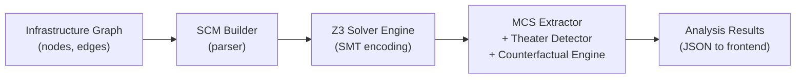

# INEVITABILITY Engine Deep-Dive: Z3, Causal Logic & Parsing

## Architecture Overview

The engine has **4 layers** that form a pipeline:



| File | Role |
|------|------|
| [scm_builder.py](file:///home/thiru/INEVITABILITY/backend/scm_builder.py) | **Parser** — converts infrastructure graph → formal SCM |
| [solver_engine.py](file:///home/thiru/INEVITABILITY/backend/solver_engine.py) | **Z3 Core** — encodes SCM as SMT formulas, runs satisfiability |
| [mcs_extractor.py](file:///home/thiru/INEVITABILITY/backend/mcs_extractor.py) | **MCS** — finds minimal control sets to block attacks |
| [counterfactual.py](file:///home/thiru/INEVITABILITY/backend/counterfactual.py) | **What-If** — do-operator for toggling controls |
| [theater_detector.py](file:///home/thiru/INEVITABILITY/backend/theater_detector.py) | **Theater** — classifies controls by causal relevance |

---

## 1. The Parser: `SCMBuilder` → Turning Graphs into Math

**File**: [scm_builder.py](file:///home/thiru/INEVITABILITY/backend/scm_builder.py)

The `SCMBuilder` takes a raw infrastructure graph (nodes like servers, firewalls, identities + edges like "access", "control", "lateral movement") and converts it into a formal **Structural Causal Model (SCM)** that Z3 can reason about.

### Pipeline: `build()`

```
1. _validate_graph()          → Ensures the graph is a DAG (no cycles)
2. _to_networkx()             → Converts to networkx DiGraph for topology analysis  
3. _generate_equations()      → Creates structural equations (the core math)
4. _extract_assumptions()     → Harvests assumptions from edge constraints + control states
5. _compute_exogenous_constraints() → Identifies root variables (no parents)
```

### Structural Equation Generation

For every node that has parents (incoming edges), it creates an equation:

```
target_node = (enabling_parents) AND NOT(control_parents)
```

- **Enabling parents**: Identity, asset, or privilege nodes that *feed access* to this node (via access, lateral, escalation edges)
- **Control parents**: Control nodes connected via `control` edges — these *block* the path

Example: If `Web Server` has edges from `Attacker` (access) and `Firewall` (control):
```
web_server = attacker AND NOT(firewall)
```

---

## 2. Z3 Solver Engine: The Logical Core

**File**: [solver_engine.py](file:///home/thiru/INEVITABILITY/backend/solver_engine.py)

This is where the mathematical rigor lives. Every node in the infrastructure becomes a **Z3 Boolean variable**, and every relationship becomes a **logical constraint**.

### Z3 Variable Construction

```python
# Each infrastructure node → one Boolean variable
self._z3_vars[node.id] = Bool(node.id)
```

`True` = this node is compromised/reachable by the attacker  
`False` = this node is safe/unreachable

### SCM Encoding as Z3 Constraints

The core encoding formula for each node:

```
target = (ANY enabler is True) AND NOT(ANY blocker is True)
```

### The do-Operator (Interventions)

When you toggle a control in the UI, the engine applies **Pearl's do-operator**:

```python
if eq.target_variable in interventions:
    constraints.append(target == BoolVal(interventions[eq.target_variable]))
    continue  # Skip the structural equation — force the value directly
```

This **severs** the node from its normal causal parents and forces it to a specific value, which is the formal definition of a causal intervention.

### Exogenous Constraints

Root variables get default values:

| Node Type    | Default Value | Reasoning |
|-------------|---------------|-----------|
| `CONTROL`   | Matches `control_state` (`active`→True) | Reflects real deployment state |
| `IDENTITY`  | `True` | Attacker exists in the threat model |
| Other roots | Unconstrained | Z3 explores both True/False |

### Satisfiability Check (Core Z3 Call)

```python
solver = Solver()
solver.set("timeout", 30000)       # 30-second timeout

# Add all constraints
for c in self._encode_scm(interventions): solver.add(c)
for c in self._encode_exogenous_constraints(interventions): solver.add(c)
solver.add(goal_formula)

result = solver.check()  # ← THE Z3 CALL
```

---

## 3. MCS Extraction: Finding the Minimal Defense

**File**: [mcs_extractor.py](file:///home/thiru/INEVITABILITY/backend/mcs_extractor.py)

The MCS (Minimal Causal Set) answers: **"What is the smallest set of controls that, if all enforced, makes the attack impossible?"**

### Algorithms

1.  **Greedy**: Iteratively adds the most impactful control until the goal is UNSAT.
2.  **Exact**: Exhaustive subset search to find truly minimal combinations that block the attack.

---

## 4. Theater Detection: Who's Irrelevant?

**File**: [theater_detector.py](file:///home/thiru/INEVITABILITY/backend/theater_detector.py)

For each control, it runs **two Z3 checks** (Enabled vs Disabled) and measures the impact on the inevitability score.

Classification:

| Δ (score_diff) | In MCS? | Classification |
|----------------|---------|----------------|
| < 0.01         | —       | **IRRELEVANT** (security theater) |
| any            | Yes     | **CRITICAL** |
| ≥ 0.20         | No      | **NECESSARY** |
| 0.01 – 0.19    | No      | **PARTIAL** |

---

## 5. Narrative Generation: The "BECAUSE..." Logic

**File**: [explainability.py](file:///home/thiru/INEVITABILITY/backend/explainability.py)

The tool uses a **deterministic backward trace** through the Z3 math to generate human-readable narratives. It follows the "True" paths in the Z3 witness from the goal back to the attacker.

| Node Type | Template Example |
|---|---|
| **Asset** | `BECAUSE '{parent}' provides {access} via '{label}', '{node}' is compromised` |
| **Privilege** | `BECAUSE '{parent}' has {privilege} to '{node}'` |
| **Channel** | `BECAUSE '{parent}' enables network path to '{node}'` |

---

## Z3's Logical Limits in This System

| Limit | How It's Handled |
|-------|-----------------|
| **Timeout** | 30-second cap per solver call |
| **Boolean-only** | All variables are `Bool` — no numeric reasoning |
| **One witness at a time** | Z3 returns *a* solution (one attack path), not *all* of them |
| **No probabilities in Z3** | Handled separatey by Monte Carlo simulations in the probability engine |
