<div align="center">

<!-- Header Banner -->


<br/>

[](https://python.org)
[](https://fastapi.tiangolo.com)
[](https://github.com/Z3Prover/z3)
[](LICENSE)

<br/>

**The cybersecurity industry spends $188B/year answering _"What might happen?"_**
**INEVITABILITY answers _"What MUST happen?"_**

<br/>

> 🔬 **Formal verification meets offensive security.**
> Instead of probabilistic risk scores, INEVITABILITY uses Z3 SMT solving over Structural Causal Models
> to compute mathematically provable inevitability scores — proving which breaches are structurally
> guaranteed given your current infrastructure topology.

<br/>

[🚀 Quick Start](#-quick-start) · [📐 Architecture](#-architecture) · [🔮 Features](#-core-features) · [🧬 Breach Studies](#-real-world-breach-reconstruction) · [📖 PRD](#-documentation)

</div>

---

## 🎯 What Makes This Different

<table>
<tr>
<td width="50%">

### Traditional Security Tools
```
❌ Probabilistic risk scores
❌ "This MIGHT happen"
❌ Reachability analysis only
❌ Cannot prove control necessity
❌ Security theater goes undetected
```

</td>
<td width="50%">

### INEVITABILITY
```
✅ Mathematical proof of inevitability
✅ "This MUST happen — here's the proof"
✅ Causal necessity analysis via SMT
✅ Proves which controls actually matter
✅ Detects and quantifies security theater
```

</td>
</tr>
</table>

**Core insight:** If removing a security control doesn't change the inevitability score of any attack goal, that control is **security theater** — structurally irrelevant regardless of its vendor rating, compliance checkbox, or annual cost.

---

## 🚀 Quick Start

### Prerequisites

- **Python 3.11+**
- **pip** (Python package manager)

### Installation

```bash
# Clone the repository
git clone https://github.com/shiri-09/INEVITABILITY.git
cd INEVITABILITY

# Install dependencies
pip install -r requirements.txt

# Launch the platform
python -m uvicorn backend.api:app --host 0.0.0.0 --port 8000
```

### 🌐 Access

| Interface | URL |
|-----------|-----|
| **Dashboard** | [http://localhost:8000](http://localhost:8000) |
| **API Docs** | [http://localhost:8000/docs](http://localhost:8000/docs) |
| **ReDoc** | [http://localhost:8000/redoc](http://localhost:8000/redoc) |

> **Windows users:** You can also double-click `start.bat` for one-click launch.

---

## 📐 Architecture

```
INEVITABILITY/
│
├── backend/                    # Python causal analysis engine
│   ├── models.py               # Pydantic data models (SCM, goals, nodes, edges)
│   ├── scm_builder.py          # Structural Causal Model constructor
│   ├── solver_engine.py        # Z3 SMT-based inevitability solver
│   ├── mcs_extractor.py        # Minimal Causal Set extraction
│   ├── theater_detector.py     # Security theater identification
│   ├── counterfactual.py       # "What-if" counterfactual analysis
│   ├── economic.py             # Cost-impact & ROI calculations
│   ├── collapse.py             # Infrastructure collapse simulation
│   ├── explainability.py       # Human-readable proof narratives
│   ├── breach_data.py          # 6 real-world breach reconstructions
│   ├── advanced_features.py    # Multi-goal optimizer, certification, forecasting
│   └── api.py                  # FastAPI REST layer + static file serving
│
├── frontend/                   # Interactive dashboard
│   ├── index.html              # Single-page application shell
│   ├── app.js                  # Rendering engine & API integration
│   └── style.css               # Animations, transitions, responsive design
│
├── requirements.txt            # Python dependencies
├── start.bat                   # Windows one-click launcher
├── test_api.py                 # API integration tests
└── INEVITABILITY_PRD.md        # Full Product Requirements Document
```

### System Flow

```mermaid
graph LR
    A[Infrastructure<br/>Topology] --> B[SCM Builder]
    B --> C[Structural<br/>Causal Model]
    C --> D[Z3 SMT Solver]
    D --> E{Inevitability<br/>Score}
    E -->|≥ threshold| F[⚠️ INEVITABLE]
    E -->|< threshold| G[✅ DEFENDED]
    D --> H[MCS Extractor]
    D --> I[Theater Detector]
    D --> J[Counterfactual Engine]
    H --> K[Dashboard]
    I --> K
    J --> K
    F --> K
    G --> K
```



---

## 🔮 Core Features

### 🧮 Causal Solver Engine
The heart of INEVITABILITY — encodes your entire infrastructure as a **Structural Causal Model** and uses Microsoft's **Z3 SMT solver** to compute whether an attacker's goal is *structurally inevitable* given your current control state.

- **Boolean satisfiability** over causal graphs
- **Witness path extraction** — the exact node sequence that makes a goal inevitable
- **Intervention modeling** — toggle controls on/off and recompute in real-time

### ⚔️ Minimal Causal Sets (MCS)
Identifies the **smallest set of controls** whose failure makes a goal inevitable. Unlike traditional attack graphs, MCS gives you the mathematically minimal failure combination.

### 🎭 Security Theater Detection
Automatically identifies controls that are **structurally irrelevant** — controls that, even if removed, don't change any goal's inevitability score. These are your security theater: expensive, compliance-satisfying, but causally meaningless.

### 🔄 Counterfactual Engine
**"What if we had enabled this control?"** — Recompute the entire causal model under hypothetical interventions. Proves whether a proposed change would have *structurally prevented* a breach.

### 💰 Economic Impact Analysis
Maps causal analysis to dollars:
- **Cost per control** vs. **risk reduction achieved**
- **ROI scoring** for defense investments
- **Wasted spend detection** on theater controls

### 🌊 Collapse Simulation
Visualizes how infrastructure unravels when controls fail — frame-by-frame collapse animation showing cascading failures from initial compromise to full breach.

### 📝 Explainability Layer
Generates human-readable proof narratives: *"Goal X is inevitable because controls A, B, and C are all inactive. Even with B enabled, the path through D remains unblocked."*

---

## 🧬 Real-World Breach Reconstruction

INEVITABILITY includes **6 meticulously reconstructed breach scenarios** with full causal graphs:

| Breach | Year | Inevitability | Key Insight |
|--------|------|:------------:|-------------|
| 🌐 **SolarWinds** | 2020 | `0.92` | Supply chain + SAML forgery = email exfiltration was structurally guaranteed |
| 🏦 **Capital One** | 2019 | `0.78` | SSRF → IMDS → IAM role — a 3-hop chain with no causal blocking |
| 🔐 **Okta / Lapsus$** | 2022 | `0.85` | Third-party contractor with superuser access = 366 tenants exposed |
| 🪵 **Log4Shell** | 2021 | `0.95` | JNDI injection → RCE → cloud creds. Most controls were causally irrelevant |
| 📊 **Equifax** | 2017 | `0.97` | Unpatched Struts + flat network + plaintext creds = 76 days undetected |
| 🏢 **Enterprise Demo** | 2024 | `0.65` | Synthetic enterprise with AD, cloud, CI/CD — multiple attack surfaces |

> Each scenario includes full **attack path reconstruction**, **control mapping**, and **counterfactual analysis** showing which single controls could have prevented the breach.

---

## ⚡ Advanced Capabilities

### 🎯 Multi-Goal Strategic Optimization
Computes **Pareto-optimal defense strategies** across multiple simultaneous attack goals. Finds the cheapest set of controls that reduces all goal inevitability below threshold, ranked by ROI.

### 🏅 Certification Engine
Generates formal **security posture certification reports** with:
- Letter grades (A–F) based on structural analysis
- Per-goal pass/fail verdicts with proof artifacts
- Exportable findings with severity ratings

### 📈 Failure Forecasting
Projects how inevitability scores will **drift over time** based on common infrastructure degradation patterns:
- Privilege creep (8%/month)
- Identity sprawl (5%/month)
- Patch decay (3%/month)
- Configuration drift (4%/month)

### 💥 Goal Collision Analysis
Detects **interactions between multiple attack goals**:
- **Synergies** — fixing one goal's controls helps another
- **Conflicts** — fixing one goal worsens another
- **Independence** — goals are causally isolated

### 🔴 Adversarial Defense Testing
Red team simulation that finds the **optimal attack strategy** given current defenses. Identifies which single control bypass would be most devastating — your single points of failure.

---

## 🛠️ Tech Stack

<div align="center">

| Layer | Technology | Purpose |
|-------|-----------|---------|
| **Solver** | Z3 SMT (Microsoft Research) | Formal verification & satisfiability |
| **Backend** | FastAPI + Pydantic v2 | Type-safe REST API with auto-docs |
| **Modeling** | NetworkX + NumPy | Graph operations & numerical computing |
| **Frontend** | Vanilla JS + CSS3 | Zero-dependency responsive dashboard |
| **Server** | Uvicorn (ASGI) | High-performance async server |

</div>

---

## 📡 API Reference

### Core Endpoints

```http
GET    /api/health                          # Health check
GET    /api/demo/scenarios                  # List all breach scenarios
POST   /api/demo/run/{scenario_id}          # Run full analysis
POST   /api/demo/counterfactual             # Counterfactual what-if analysis
```

### Advanced Feature Endpoints

```http
GET    /api/advanced/optimize/{session_id}     # Multi-goal optimization
GET    /api/advanced/certify/{session_id}      # Certification report
GET    /api/advanced/forecast/{session_id}     # Failure forecasting
GET    /api/advanced/collisions/{session_id}   # Goal collision analysis
GET    /api/advanced/adversarial/{session_id}  # Red team simulation
```

### Example: Run a Breach Scenario

```bash
curl -X POST http://localhost:8000/api/demo/run/solarwinds \
  -H "Content-Type: application/json" \
  -d '{"scenario_id": "solarwinds", "algorithm": "greedy", "max_mcs_cardinality": 5}'
```

<details>
<summary>📋 Response Structure</summary>

```json
{
  "analysis_id": "uuid",
  "scenario_name": "SolarWinds Supply Chain Attack",
  "computation_time_ms": 142,
  "inevitability_results": [...],
  "mcs_results": [...],
  "theater_reports": [...],
  "economic_report": {...},
  "fragility_profile": {...},
  "collapse_frames": [...],
  "explanations": [...],
  "optimization_strategies": [...],
  "certification": {...},
  "forecast": {...},
  "goal_collisions": [...],
  "adversarial_report": {...}
}
```

</details>

---

## 📖 Documentation

| Document | Description |
|----------|-------------|
| [`INEVITABILITY_PRD.md`](INEVITABILITY_PRD.md) | Full Product Requirements Document with formal specifications |
| [`/docs`](http://localhost:8000/docs) | Interactive Swagger API documentation |
| [`/redoc`](http://localhost:8000/redoc) | ReDoc-formatted API reference |

---

## 🧪 Testing

```bash
# Run API integration tests
python test_api.py

# Manual API test
curl http://localhost:8000/api/health
```

---

## 🤝 Contributing

1. Fork the repository
2. Create a feature branch (`git checkout -b feature/amazing-feature`)
3. Commit your changes (`git commit -m 'Add amazing feature'`)
4. Push to the branch (`git push origin feature/amazing-feature`)
5. Open a Pull Request

---

## 📊 Project Stats

<div align="center">

| Metric | Value |
|--------|-------|
| **Backend Modules** | 13 |
| **Breach Scenarios** | 6 |
| **Advanced Features** | 5 |
| **Lines of Python** | ~15,000+ |
| **Lines of CSS** | ~2,000 |
| **Lines of JavaScript** | ~1,200 |
| **API Endpoints** | 10+ |

</div>

---

## 🔒 Model Limitations

- **Topology Accuracy** — Results are only as reliable as the infrastructure model fed into the system. An incorrect or incomplete causal graph will produce misleading inevitability scores.
- **Known Techniques Only** — The solver operates over modeled attack paths. Zero-day exploits and novel TTPs outside the graph are not captured.
- **Static Snapshot** — Analysis reflects a point-in-time topology. Dynamic environments (auto-scaling, ephemeral workloads) require re-modeling to stay accurate.

---

## 📄 License

This project is licensed under the MIT License — see the [LICENSE](LICENSE) file for details.

---

<div align="center">


<br/>

**Built with 🔬 formal methods and 💀 real breach data**

*"Security isn't about what's possible — it's about what's inevitable."*

</div>
